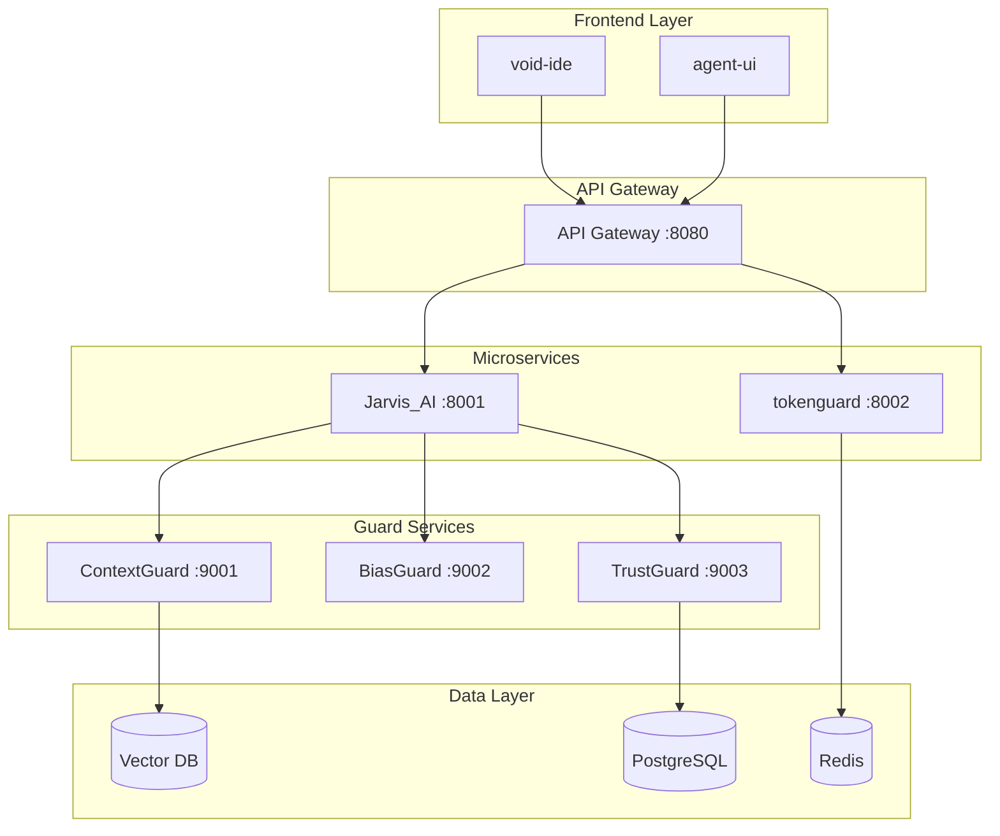

# 🔌 API Specifications & Data Flow Documentation
## Complete System Communication & Integration Patterns

**Generated**: December 17, 2025

---

## 📚 Table of Contents

1. [API Specifications](#api-specifications)
2. [Data Flow Diagrams](#data-flow-diagrams)
3. [Microservice Communication](#microservice-communication)

---

## 🔌 1. API Specifications

### **1.1 Jarvis_AI REST API**

**Base URL**: `http://localhost:8001/api/v1`

| Endpoint | Method | Description |
|----------|--------|-------------|
| `/task/execute` | POST | Execute complex task with agent coordination |
| `/task/{id}/status` | GET | Check task status |
| `/agent/spawn` | POST | Spawn a new agent |
| `/memory/store` | POST | Store information in memory |
| `/memory/retrieve` | POST | Retrieve relevant memories |

---

### **1.2 ContextGuard REST API**

**Base URL**: `http://localhost:9001/api/v1`

| Endpoint | Method | Description |
|----------|--------|-------------|
| `/context/process` | POST | Process message with context |
| `/memory/compress` | POST | Compress conversation history |
| `/memory/stats` | GET | Get memory statistics |

---

### **1.3 BiasGuard REST API**

**Base URL**: `http://localhost:9002/api/v1`

| Endpoint | Method | Description |
|----------|--------|-------------|
| `/analyze` | POST | Analyze text for biases |
| `/bias-types` | GET | List supported bias types |

---

### **1.4 TrustGuard REST API**

**Base URL**: `http://localhost:9003/api/v1`

| Endpoint | Method | Description |
|----------|--------|-------------|
| `/verify` | POST | Verify factual claims |
| `/claim/verify-single` | POST | Verify a single claim |

---

### **1.5 tokenguard-microservice REST API**

**Base URL**: `http://localhost:8002/api/v1`

| Endpoint | Method | Description |
|----------|--------|-------------|
| `/prune` | POST | Prune low-confidence tokens |
| `/analyze` | POST | Analyze response confidence |

---

## 🔄 2. System Architecture



---

## 📦 3. Docker Compose Configuration

```yaml
version: '3.8'

services:
  jarvis:
    build: ./jarvis-ai
    ports:
      - "8001:8001"
    environment:
      - OPENAI_API_KEY=${OPENAI_API_KEY}
    depends_on:
      - redis
      - postgres

  tokenguard:
    build: ./tokenguard-microservice
    ports:
      - "8002:8002"
    depends_on:
      - redis

  context-guard:
    build: ./context-guard
    ports:
      - "9001:9001"
    depends_on:
      - vector-db

  bias-guard:
    build: ./bias-guard
    ports:
      - "9002:9002"

  trust-guard:
    build: ./trust-guard
    ports:
      - "9003:9003"
    depends_on:
      - postgres

  postgres:
    image: postgres:15
    environment:
      - POSTGRES_DB=abeone
      - POSTGRES_USER=abeone
      - POSTGRES_PASSWORD=${DB_PASSWORD}

  redis:
    image: redis:7-alpine

  vector-db:
    image: qdrant/qdrant
    ports:
      - "6333:6333"
```